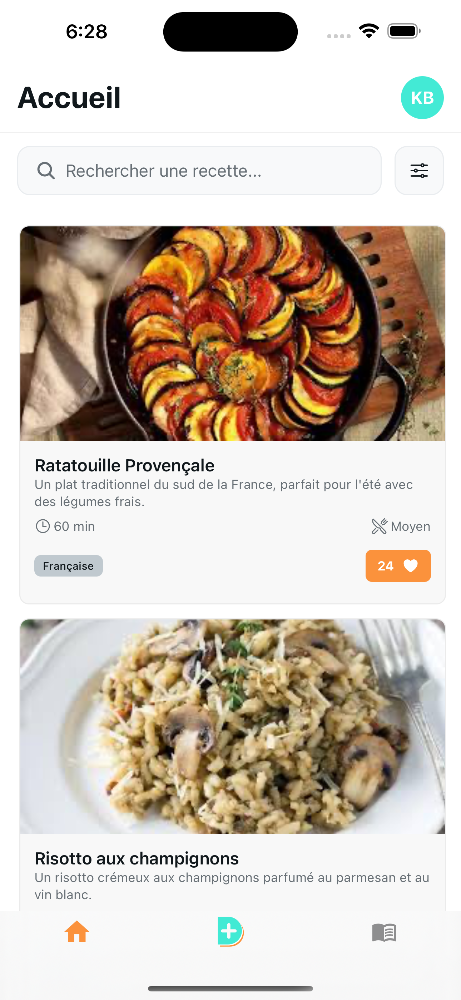

# Dishly 

 


<!--  -->


A mobile and web application that allows you to create, save, and follow your cooking recipes step-by-step. Featuring an innovative "cooking mode" with integrated timers and swipeable steps, perfect for use in the kitchen.

---

## ✨ Features

- [x] Recipe browsing with responsive design
- [x] Recipe search and filtering
- [ ] User authentication (Google OAuth)
- [ ] Create recipes with ingredients and steps
- [ ] Step-by-step cooking mode with swipeable interface
- [ ] Integrated timers that run in background
- [ ] Adjust ingredient quantities by servings
- [ ] Public/private recipe visibility
- [ ] Favorites system
- [ ] Recipe sharing

---

## 🛠 Tech Stack

### Frontend
[](https://kevinbourgitteau.fr)
- **React Native** with Expo SDK 52+
- **TypeScript** (strict mode)
- **Tamagui** for cross-platform UI
- **Expo Router** for file-based navigation

### Backend
[](https://kevinbourgitteau.fr)
- **Supabase** (PostgreSQL, Auth, Storage, API)
- **Row Level Security** (RLS) for data protection
- **PostgREST** auto-generated API

### Testing
[](https://kevinbourgitteau.fr)
- **Jest** for unit tests
- **Detox** for e2e mobile tests (optional)
- **Cypress** for e2e web tests (optional)

---

## 📲 Deployment

[](https://kevinbourgitteau.fr/)
- **Supabase** - Backend hosting (PostgreSQL, Auth, Storage)
- **Expo EAS** - Mobile app builds and updates
- **Expo Web** - Progressive Web App (PWA)

---

## 🚀 Getting Started

### Prerequisites

- Node.js 18+
- pnpm (recommended) or npm
- Expo CLI
- Supabase CLI (for local development)

### Installation

```bash
# Clone the repository
git clone https://github.com/ka-be/dishly.git
cd dishly

# Install dependencies
cd client
pnpm install

# Setup environment variables
cp .env.example .env
# Edit .env with your Supabase credentials
```

### Local Development

#### Start Supabase (local stack)

```bash
# In project root
supabase start

# Run database migrations
supabase db push

# Generate TypeScript types from database schema
supabase gen types typescript --local > client/lib/database.types.ts

# Access Supabase Studio: http://localhost:54323
```

#### Start Expo Development Server

```bash
# In /client directory
pnpm start

# Run on specific platform
pnpm android  # Android emulator
pnpm ios      # iOS simulator
pnpm web      # Browser
```

---

## 📁 Project Structure

```
/client                  # Expo React Native app
  /app                   # Expo Router (file-based routing)
    /(tabs)              # Tab navigation
  /components            # Reusable UI components
    /ui                  # Base components
    /recipe              # Recipe-specific components
    /timer               # Timer components
  /lib                   # Utilities, Supabase client
  /types                 # TypeScript type definitions
  /hooks                 # Custom React hooks
  /constants             # App constants (colors, etc.)
  
/documentation           # Project documentation
  /concept/diagrams      # PlantUML diagrams (architecture, ERD, etc.)
  SPECIFICATIONS.md      # Complete project specifications (FR)
```

---

## 📚 Documentation

- **Specifications** : [French 🇫🇷](./documentation/SPECIFICATIONS.md)
- **Architecture** : See `/documentation/concept/diagrams/`
  - [Architecture Diagram](./documentation/concept/diagrams/architecture.puml)
  - [Entity Relationship Diagram](./documentation/concept/diagrams/erd.puml)
  - [Use Cases](./documentation/concept/diagrams/usecases.puml)
  - [Activity & Sequence Diagrams](./documentation/concept/diagrams/)

---

## 🧪 Testing

```bash
# Run unit tests
pnpm test

# Run tests with coverage
pnpm test:coverage

# Run linter
pnpm lint

# Type checking
pnpm type-check
```

---

## 🎯 Roadmap

### Phase 1 - Setup & Infrastructure (Current)
- [x] Architecture definition
- [x] Database schema design
- [x] Documentation complete
- [ ] Supabase setup
- [ ] Authentication integration

### Phase 2 - MVP (Recipe CRUD)
- [ ] Recipe creation with ingredients and steps
- [ ] Recipe listing and detail view
- [ ] Image upload to Supabase Storage
- [ ] Edit and delete recipes

### Phase 3 - User Features
- [ ] Favorites system
- [ ] Search and filters
- [ ] User profile management
- [ ] Public/private recipes

### Phase 4 - Advanced UX
- [ ] Step-by-step cooking mode
- [ ] Integrated timers
- [ ] Ingredient quantity adjustment
- [ ] Offline mode

### Phase 5 - Future
- [ ] Recipe scraping from websites
- [ ] Recipe sharing and forking
- [ ] Meal planning
- [ ] Shopping list generation
- [ ] Smartwatch integration

For complete roadmap, see [SPECIFICATIONS.md](./documentation/SPECIFICATIONS.md).

---

## 📸 Screenshots



---


## 📄 License

This project is licensed under the MIT License.

---

## 🔗 Links

[](https://kevinbourgitteau.fr/)
[](https://github.com/ka-be)
[](https://codepen.io/ka-be)
[](https://stackoverflow.com/users/13797852/kevin-bjto)
[](https://www.behance.net/kaabe)
[](https://dribbble.com/Kaabee)
[](https://fr.linkedin.com/in/kevin-bourgitteau)
[](https://twitter.com/BjtoKevin)

---

*Made with ❤️ by [Kevin Bourgitteau](https://kevinbourgitteau.fr)*