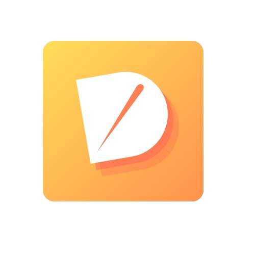

# Dishly 

<!-- 
 -->

A mobile application that will allow you to create your own cooking recipes and easily recreate them, step by step.

_This application is created as part of my professional project for obtaining my Bachelor's degree in Application Design and Development._

---
* Specifications : [French 🇫🇷](./documentation/specs-fr.md) | [English 🇬🇧](./documentation/specs-en.md)
* [How to start the project](./documentation/start-project.md)

## 🛠 Tech Stack

**Client:**

  

    
    
**Server:**

**Testing:**

        
**ORM:**

**Other:**

---

<!-- ## 📲 Deployment

--- -->

<!-- ## 📸 Screenshots

--- -->

## 🔗 Links

