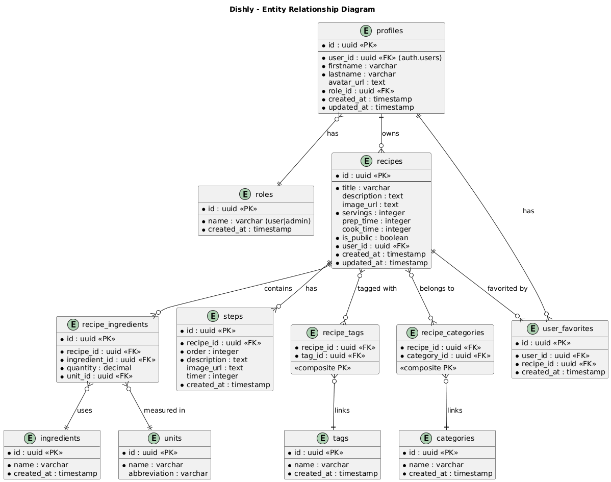

# Dishly - Specifications - FR 🇫🇷

## Qu'est-ce que Dishly ?
Dishly est une application de cuisine permettant de créer, visualiser et suivre les étapes de manière simple et intuitive de ses propres recettes.
Pour chaque recette de cuisine, l'application sera divisée en 2 onglets : un onglet ingrédients et un onglet étapes, qui pourront être suivies pas à pas.

## Quel est l'objectif du projet ?
L'objectif de ce projet est de développer un prototype fonctionnel *(Utilisable sur téléphone mobile ou tablette si possible)* de Dishly, selon les spécifications ci-après.

## Specifications - Phase 1 : Backend

### Spécifications techniques

Développement du backend avec les technologies suivantes :
* **Language** : TypeScript
* **Serveur** : Apollo
* **API** : GraphQL
* **Base de données** : PostgreSQL
* **ORM** : Prisma
* **Authentification** : JWT

La structure sera conteneurisée sous Docker.
Dans un premier temps, la dat sera générée aléatoirement pour le développement.
Si possible, ajout du cache.

### Spécifications fonctionnelles
 
1. Création dans un premier temps du backend **sans authentification et authorisation**, avec un single role user (admin)
2. Dans un deuxième temps, ajout d'un **middleware** conteneurisé pour y intégrer l'authentification et authorisation avec les roles *admin* et *user*.

#### Entités
* **User** : 
Un utilisateur possède un lastname, un firstname, une adresse mail, un mot de passe et un role (user par défaut)
* **Role** : 
Un role possède un nom (user ou admin)
* **Recipe** : 
Une recette possède un titre, une image, un nombre de convives, des ingrédients, des tags, des types, un owner et des étapes.
* **RecipeIngredient** : 
Un ingrédient de recette possède un ingrédient, une quantité et une unité
* **Ingredient** : 
Un ingrédient possède un nom
* **Tag** : 
Un tag possède un nom
* **Catégory** : 
Une catégorie possède un nom
* **Step** : 
Une étape possède une description et une image
* **Unit**
Une unité possède un nom

#### User Stories
En tant qu'**admin**, je peux : 
- Voir toutes les recettes
- Créer une recette
- Modifier / Supprimer toutes les recettes
- Modifier / Supprimer un utilisateur

En tant qu'**user**, je peux :
- Voir mes recettes
- Créer une recette
- Modifier / Supprimer mes recettes
- Modifier mon compte utilisateur

<!-- Ajout de visualisation selon filtres TODO -->

## Specifications - Phase 2 : Frontend

### Spécifications techniques
* **Language** : TypeScript
* **Framework / Librairie** : Expo + React Native
* **UI** : SASS ou Tailwind (à déterminer)

La structure sera également conteneurisée sous Docker.

### Spécifications fonctionnelles

<!-- The specifications of the second phase will be defined later. -->

<!--  -->
<!-- AUTRE EXEMPLE -->
<!--  -->

## Specifications - Perspectives d'évolution
Envoi des étapes sur montre connectée, partage entre amis de recette, récupération de recettes existantes, fork etc...

## Proposition technique

### Architecture

- Architecture préconisée : **Micro-services**
- Cette dernière facilitera la maintenance de l'application, ainsi que son grand **potentiel de scalabilité** comme demandé dans les spécifications : L'échelle de chaque service pourra être ajustée en fonction du besoin et de l'évolution du nombre d'utilisateurs de la plateforme avec un impact faible sur les autres services de l'application. Elle est également particulièrement adaptée pour la gestion des données en temps réel.
- Elle permettra également une indépendance des services qui facilitera les évolutions de ces derniers (Changement de techno, mises à jour etc..) ainsi que la mise en place de tests indépendants

### UMLs
#### UseCases

#### Diagramme relations - entités

#### Diagramme de l'architecture dockerisée

<!--  TODO  -->

#### Diagramme d'activité
<!--  TODO  -->

#### Diagramme de séquence 
<!--  TODO  -->

### Plan de tests

#### Inscription

| Test                       | Procédure                                                           | Résultat attendu                                  | Statut |
| -------------------------- | ------------------------------------------------------------------- | ------------------------------------------------- | ------ |
| Avec des données valides   | L'utilisateur entre un email valide et un mot de passe valide       | L'utilisateur est redirigé vers la page d'accueil | 🟢     |
| Avec e-mail déja existant  | L'utilisateur entre un email déjà utilisé et un mot de passe valide | Message d'erreur (L'utilisateur existe déjà)      | 🔴     |
| Avec e-mail invalide       | L'utilisateur entre un email invalide et un mot de passe valide     | Message d'erreur (L'email n'est pas valide)       | 🔴     |
| Avec mot de passe invalide | L'utilisateur entre un email valide et un mot de passe invalide     | Message d'erreur (Mot de passe invalide)          | 🔴     |

#### Connexion

| Test                       | Procédure                                                                   | Résultat attendu                                  | Statut |
| -------------------------- | --------------------------------------------------------------------------- | ------------------------------------------------- | ------ |
| Avec des données valides   | L'utilisateur entre un email valide et un mot de passe valide               | L'utilisateur est redirigé vers la page d'accueil | 🟢     |
| Avec e-mail invalide       | L'utilisateur entre un email inexistant ou eronné et un mot de passe valide | Message d'erreur (Utilisateur non reconnu)        | 🔴     |
| Avec mot de passe invalide | L'utilisateur entre un email valide et un mot de passe invalide             | Message d'erreur (Mot de passe erronné)           | 🔴     |

## Design
### Logo
<!--  TODO  -->

### Couleurs & typographie
<!--  TODO  -->

#### Couleurs
<!--  TODO  -->

#### Typographie
<!--  TODO  -->

### Maquette & Zonage
#### Maquette
<!--  TODO  -->

#### Zonage
<!--  TODO  -->